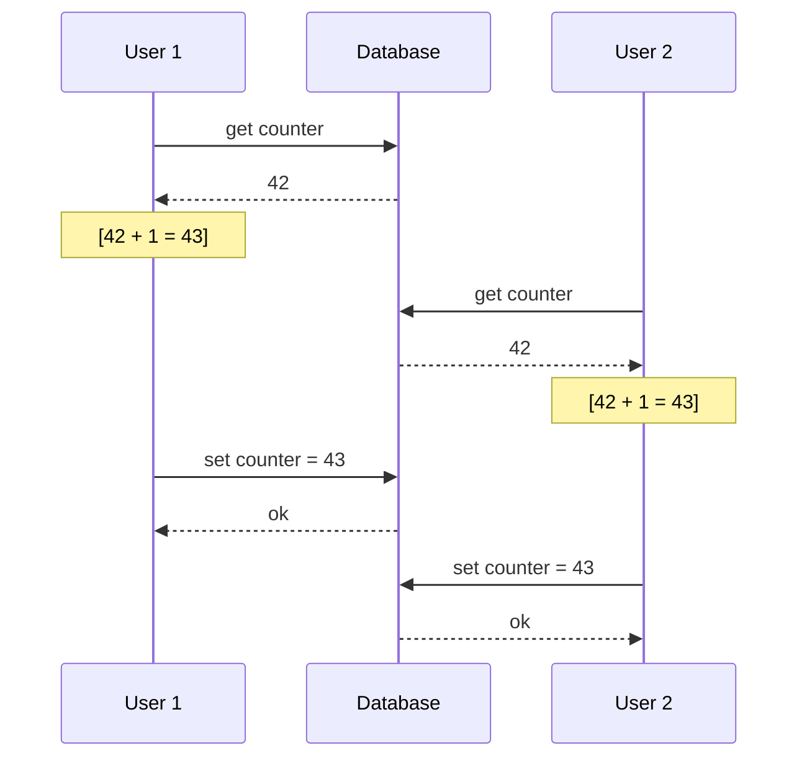
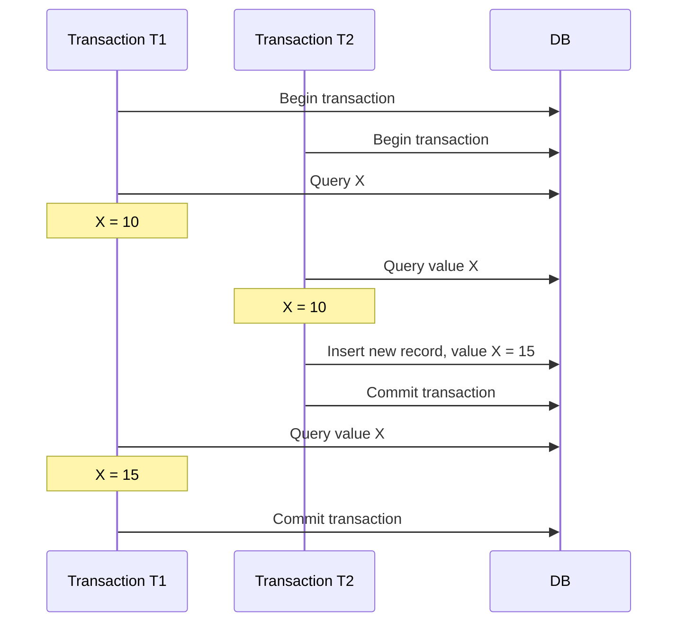
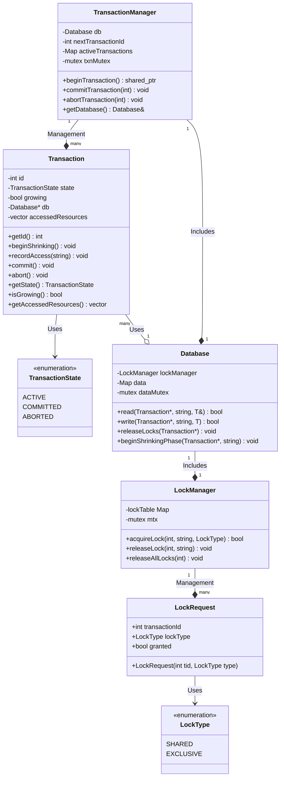
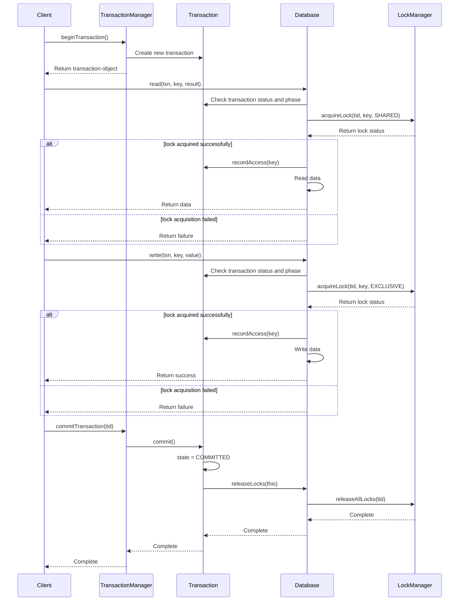
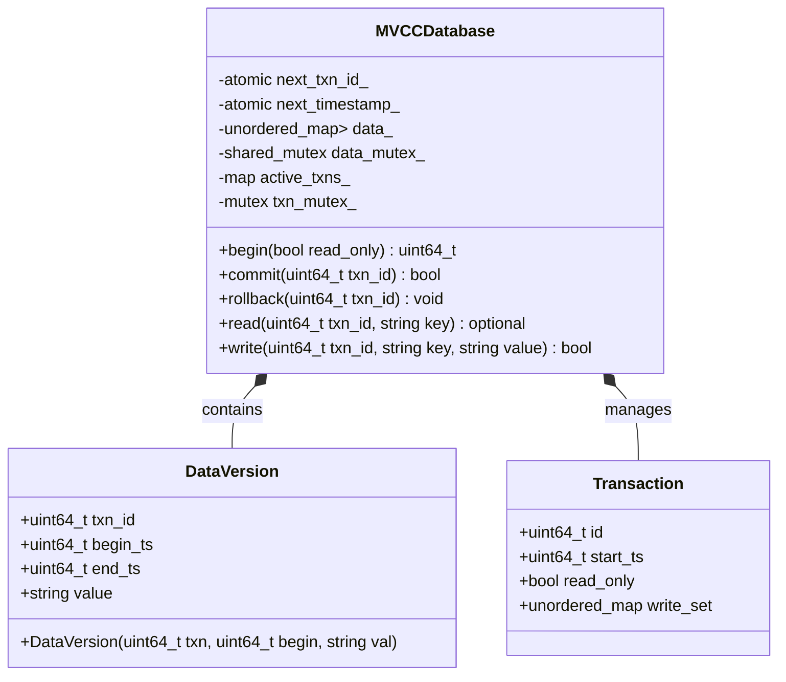

## Why transactions exist

> "In the harsh reality of data systems, many things can go wrong:
> 1. The database software or hardware may fail at any moment (including in the middle of a write operation).
> 2. The application may crash at any moment (including in the middle of a series of operations).
> 3. Network interruptions may unexpectedly cut the connection between the database and the application, or between databases.
> 4. Multiple clients may write to the database at the same time, overwriting each other's changes.
> 5. A client may read nonsensical data because the data was only partially updated.
> 6. Race conditions between clients may cause surprising errors."
> --- *Designing Data-Intensive Applications*

In concurrent programming, we often care about the correctness of multiple threads/processes/coroutines modifying the same block of memory, and we solve this with atomic variables and locks to implement critical sections. In real life and in development, however, it's more often the case that an actor completes a task through a series of operations, and here too we want something like an atomic variable to protect that series of operations, preventing unexpected situations when multiple actors operate at once.

Imagine you're using your mobile banking app to transfer money to a friend. This process actually has two steps: deduct the money from your account, then add the money to your friend's account. So here's the problem:

1. What if only half of it completes? [Atomicity]

Suppose the banking system suddenly loses power after deducting your money, and never adds the money to your friend's account. Now the money has vanished into thin air! Your account is short, but your friend never received it.

Transactions exist to solve exactly this: **they ensure that a group of related operations either all complete, or none of them happen at all**. It's like tying a safety rope to these operations so they can't quit halfway.

 2. What if multiple people operate at the same time? [Isolation]

Imagine you and your family share a bank account with 1000 yuan in it. You're at the mall about to swipe your card for an 800-yuan purchase, and at the same moment, your spouse is at the supermarket wanting to use the same account to buy 500 yuan of groceries.

Without proper control, this could happen: the system first checks that the account has 1000 yuan (enough for 800), then your spouse's side also checks that it has 1000 yuan (enough for 500). In the end you both spend 1300 yuan at the same time, exceeding the 1000 yuan in the account!

Transactions solve this problem: **they ensure that while one person is operating, everyone else either sees the state before the operation or the state after it, never the intermediate state, avoiding conflicting operations**.

3.  Will the data suddenly disappear? [Durability]

Suppose you're filling out a very long form online, and after much effort you finally submit it and the system says "saved successfully" — but the next day you log in and the information is gone! It turns out the system crashed after showing success but before it had actually written anything to disk.

**Transactions ensure that once the system tells you "the operation succeeded", your data won't be lost even if the system crashes the very next second**. It's like putting a safety lock on your important materials.

In summary, the transaction model is a programming model that provides atomicity/isolation/durability for multiple operations. That is, the ACID model of transactions. [A: Atomicity, C: Consistency, I: Isolation, D: Durability]

## ACID transaction properties:

### Atomicity:
This atomicity is really a derivative of the concept of "atomic" in computing. In computing, atomicity means an operation or piece of data has no intermediate state — only a beginning and an end, nothing in between. The atom that transactions talk about actually does have intermediate states, but those intermediate states cannot be interfered with by any other actor, and if the transaction aborts, all operations within it are rolled back. The DDIA book prefers to call this **abortability**: "the ability to abort a transaction on error and have all writes from that transaction discarded."

### Consistency:
Transaction consistency is the most central yet most easily misunderstood concept among the ACID properties. Formally speaking, consistency means that before and after a transaction executes, the database must move from one consistent state to another consistent state. A consistent state is one in which the data in the database satisfies all predefined integrity constraints.
1. **Entity Integrity**: Implemented through primary key constraints, ensuring every entity has a unique identifier
2. **Referential Integrity**: Implemented through foreign key constraints, guaranteeing the validity of reference relationships between entities
3. **Domain Integrity**: Implemented through data types, CHECK constraints, and so on, ensuring attribute values satisfy predefined rules
4. **User-Defined Integrity**: Implemented through triggers, stored procedures, and so on, enforcing specific business rules

Consistency can be viewed as a process of preserving an invariant, ensuring that database state transitions conform to business rules and domain logic. Unlike atomicity and isolation, the guarantee of consistency depends not only on the database system itself but also on the application correctly implementing business logic. At the same time, atomicity, isolation, and durability are the technical means by which consistency is achieved.

### Isolation:
Isolation means that the operations, intermediate states, and variables of two transactions are invisible to each other — even if one user performs a write, other users cannot see it.

The simplest approach is to make transactions fully serial, which completely guarantees that no intermediate state is visible between transactions. But in practice, to improve efficiency, isolation is usually relaxed into 4 levels:
1. Read Uncommitted
2. Read Committed
3. Repeatable Read
4. Serializable
These four levels get progressively stricter from top to bottom. At the same time, different isolation levels mainly give rise to three problems:

5. Dirty read: reading uncommitted content from another transaction.
6. Non-repeatable read: reading content committed by another transaction while your own transaction is still uncommitted. Two reads return different results.

7. Phantom read: within the same transaction, the same query condition executed twice returns a different **set of records**. For example: transaction A queries all accounts with balance > 500 and gets 3 records; meanwhile transaction B inserts a new account with balance 1000 and commits; when transaction A runs the same query again, it gets 4 records. This mainly involves INSERT or DELETE operations causing the number of matching records to change. The core difference from a non-repeatable read is that a phantom read is not about the value of some piece of data changing, nor about contention between pieces of data, but about another transaction's insert changing the set of records returned by the query.
8. Write skew: a more extreme form of phantom read. It happens because a transaction uses a **set of records** to make a decision and then executes a subsequent step. For example, DDIA has this scenario: two doctors both want to go off duty, but the hospital requires that at least one must be on duty, so when the two submit their requests to go off duty, the following happens:

Because of how the check works, the transactions for both going off duty complete at the same time, violating the requirement that only one may go off duty.

MySQL InnoDB avoids phantom reads and write skew by providing gap locks ["materializing conflicts"]. A gap lock can lock the prev/next pointers of a B+ tree within a range, thereby preventing updates within that range and thus preventing problems caused by differing records at select time.
How to use it: `SELECT * FROM table WHERE id BETWEEN 10 AND 20 FOR UPDATE`:
- InnoDB locks not only the records with values 10 and 20
- It also locks the gap (10,20), preventing other transactions from inserting values like 15
- It even locks the gaps (negative infinity,10) and (20, positive infinity), completely preventing phantom reads / write skew

| Isolation Level                       | Dirty Read  | Non-repeatable Read  | Phantom Read  | Write Skew  |
| -------------------------- | ------------------ | ------------------------------ | -------------------- | ------------------- |
| Read Uncommitted  | ✓ Can happen              | ✓ Can happen                          | ✓ Can happen                | ✓ Can happen               |
| Read Committed    | ✗ Does not happen             | ✓ Can happen                          | ✓ Can happen                | ✓ Can happen               |
| Repeatable Read   | ✗ Does not happen             | ✗ Does not happen                         | ✓ Can happen+               | ✓ Can happen               |
| Serializable (Serializable)     | ✗ Does not happen             | ✗ Does not happen                         | ✗ Does not happen               | ✗ Does not happen              |
*Note: Some database implementations (such as MySQL InnoDB) also prevent phantom reads at the repeatable read level through gap locks, but the repeatable read level in the standard SQL specification does not guarantee protection against phantom reads.*

## Implementing the ACID transaction model
An ACID implementation generally means one that satisfies the ACID requirements and has a serializable isolation level.

### True Serializability
Transactions do not run concurrently; they execute strictly in order. This is common in databases with single-threaded lightweight operations, such as Redis. As memory keeps growing [in-memory databases] and OLTP transactions get shorter and shorter, single-threading also has lower locking overhead.

Generally, this kind of implementation needs to satisfy:
1. Every transaction must be small and fast. A single slow transaction will slow down all transaction processing.
2. It is limited to cases where the active dataset fits in memory. Rarely accessed data may be moved to disk, but if it needs to be accessed within a single-threaded transaction, the system becomes extremely slow.
3. Write throughput must be low enough to be handled on a single CPU core. Otherwise, transactions need to be partitionable into a single partition and must not require cross-partition coordination.
4. Cross-partition transactions are possible, but the extent to which they can be used is heavily restricted.

### 2PL Two-Phase Locking

Two locks are implemented: the shared lock [denoted by S below] and the exclusive lock [denoted by X below]. These correspond to the read lock of a read-write lock, and all read and write operations must be protected by locks, with write priority over read.
1. If a transaction wants to read an object, it must first acquire the lock in shared mode. Multiple transactions are allowed to hold shared locks simultaneously. But if another transaction already holds an exclusive lock on the object, these transactions must wait.
2. If a transaction wants to write to an object, it must first acquire the lock in exclusive mode. No other transaction can hold the lock at the same time (whether in shared mode or exclusive mode), so if any lock exists on the object, the transaction must wait.
3. If a transaction reads an object and then writes to it, it may upgrade its shared lock to an exclusive lock. Upgrading a lock works the same as directly acquiring an exclusive lock.
4. After a transaction acquires a lock, it must continue to hold the lock until the transaction ends (commit or abort). This is where the name "two-phase" comes from: the first phase (while the transaction is executing) acquires locks, and the second phase (at the end of the transaction) releases all locks.

Two-phase locking can solve the dirty read / repeatable read problem, but it cannot solve the phantom read / read skew problem:

Implementation core:
1. LockManager provides the basic lock implementation, mainly implementing lock upgrade [switching between X-S locks] and lock recording [associating with transactions]

| Current resource state        | Requested lock type       | Result     | Description                  |
| ------------- | ----------- | ------ | ------------------- |
| **No lock**        | Shared lock (S)      | Acquired successfully   | Resource transitions from no lock to shared lock state      |
| **No lock**        | Exclusive lock (X)      | Acquired successfully   | Resource transitions from no lock to exclusive lock state      |
| **Shared lock** (transaction A)  | Shared lock (transaction B)    | Acquired successfully   | Multiple transactions can hold shared locks simultaneously        |
| **Shared lock** (transaction A)  | Exclusive lock (transaction A)    | Acquired successfully   | Lock upgrade: only when A is the sole transaction holding the shared lock |
| **Shared lock** (transaction A)  | Exclusive lock (transaction B)    | Acquisition failed   | Exclusive locks are incompatible with any other lock        |
| **Shared lock** (multiple transactions) | Exclusive lock (one of the transactions) | Acquisition failed   | Lock upgrade failed: other transactions still hold shared locks    |
| **Exclusive lock** (transaction A)  | Shared lock (transaction A)    | Already holds a stronger lock | Exclusive lock privileges include shared lock privileges        |
| **Exclusive lock** (transaction A)  | Shared lock (transaction B)    | Acquisition failed   | Exclusive locks are incompatible with any other lock        |
| **Exclusive lock** (transaction A)  | Exclusive lock (transaction A)    | Already holds the lock   | Repeatedly acquiring the same lock             |
| **Exclusive lock** (transaction A)  | Exclusive lock (transaction B)    | Acquisition failed   | Exclusive locks are incompatible with any other lock        |

2. Transaction: during a transaction, if a task has read/write operations it starts locking; it manages the state machine of S-X locks and records the read/write records on the Transaction.
3. TransactionManager: used to record conflicts and records between multiple Transactions, manages multiple Transactions, and is also the transaction interface, providing various transaction operations, such as starting a transaction and committing a transaction.
4. Database: provides read and write interfaces, and also provides the transaction's `beginShrinkingPhase` display to let the transaction enter the shrinking phase; after the method is entered, access to new resources is forbidden. `releaseLocks` transaction Commit releases all locks.

A simple implementation logic:

### Multi-Version Concurrency Control [MVCC]:
MVCC is not a necessary path to implementing database transactions, but the multi-version isolation it provides does improve concurrency, and it is generally used to implement the two isolation mechanisms "read committed" and "repeatable read". It achieves non-blocking read-write concurrency by maintaining multiple versions of the data, while also guaranteeing transaction isolation. Its core mechanism is maintaining a version chain for each row of data, where each data version is associated with the transaction IDs that created and deleted it; at query time, only the versions visible to the current transaction are accessed based on its snapshot. For example, in PostgreSQL, after transaction T1 (txid=100) begins, transaction T2 (txid=101) updates the record with id=1 in the users table, changing name from "Alice" to "Bob" and commits; at this point the system creates a new version (name="Bob", xmin=101) and marks the old version (name="Alice", xmin=95, xmax=101); when T1 queries that record, following snapshot isolation rules, it can only see versions where xmin<100 and xmax is empty or xmax>100, so it returns "Alice", while a new transaction T3 will see "Bob", thereby achieving transaction isolation and concurrency without using locks.

A simple MVCC implementation, borrowing here from LevelDB's MVCC implementation:
1. DataVersion: the DataModel of the underlying data record
2. Transactions: used for transaction management; write_set records write events so conflicts can be arbitrated at the end.
3. MVCCDataBase: management of the user data interface:
	1. active_txns_: provides the underlying transactions
	2. data_: used to store version information, stored in chronological order.

Read logic: a transaction can only read data versions that already existed (were committed) when it started. This ensures repeatable read, because no matter how other transactions modify the data, the current transaction always sees a consistent snapshot of the data as of when it started.
1. First, acquire the transaction lock `txn_mutex_`
2. Check whether the transaction ID is valid (whether it exists among the active transactions)
3. Check whether the transaction's write set already contains a write record for this key
    - If so, return the value from the write set directly (this ensures the transaction can see its own modifications)
4. If the transaction's write set does not contain this key, read from the data store
    - Acquire the data shared lock `data_mutex_` (read lock)
    - Look up all versions corresponding to the key
    - If the key does not exist, return empty
5. Among all the versions found, traverse backwards starting from the newest version, looking for a version that meets the conditions:
    - The version's start timestamp `begin_ts` is less than or equal to the transaction's start timestamp `txn.start_ts`
    - The version's end timestamp `end_ts` is greater than the transaction's start timestamp, or the version's end timestamp is the maximum value (meaning the current version is valid)
6. Return the value of the first version that meets the conditions

Write logic: characteristic: write operations do not directly modify the data in the database; they only record the write intent in the transaction's private cache (`write_set`). Modifications at this stage are visible only to the current transaction and invisible to other transactions; no new data version is created, only the value to be written is recorded.
1. Store the write operation directly in the intent table `txn.write_set`; a new version is produced at commit time.

Commit logic: check for conflicts, commit the new version into _data
1. **Conflict detection**:
    - Check whether any other transaction created a new version after the current transaction started
    - If a conflict exists, roll back the transaction and discard all writes
2. **Version update**:
    - Mark the currently active version as expired (set its `end_ts` to the current commit timestamp)
    - Create a new data version for each modified key
    - The new version uses the commit timestamp as its start timestamp (`begin_ts`)
3. **Write characteristics**:
    - Multiple write entries are committed or rolled back together as one atomic unit
    - Writes are implemented by creating new versions rather than modifying existing data
    - All writes share the same commit timestamp, ensuring consistency

#### How MVCC Is Implemented in MySQL
In MySQL, MVCC is implemented based on the undo log. First, InnoDB maintains two hidden columns in each row of data:
- **DB_TRX_ID**: the ID of the transaction that created or last modified the row
- **DB_ROLL_PTR**: the rollback pointer, pointing to the previous version in the undo log
- **DB_ROW_ID**: (optional) the row ID, used when the table has no primary key

Write logic:

1. **Write intent phase**:

    - Acquire an exclusive lock (X lock)
    - Copy the original data into the undo log
    - Link the undo log entries together to form a version chain
2. **Actual modification**:

    - Modify the data row in the table directly
    - Update DB_TRX_ID with the current transaction ID
    - Update DB_ROLL_PTR with the pointer to the newly recorded undo log entry
3. **Commit phase**:

    - Write the redo log and flush it to disk (durability)
    - Release the row lock
    - Mark the transaction as committed

Read logic: a read operation creates a Read View, which contains the following information:

- **creator_trx_id**: the ID of the transaction that created the view
- **trx_ids**: the list of all active transaction IDs at the time the view was created
- **up_limit_id**: the smallest ID among the active transactions
- **low_limit_id**: the next transaction ID to be allocated

Version visibility rules:

1. If the row's `DB_TRX_ID < up_limit_id`, the version was created by a transaction that committed long ago, so it is visible
2. If the row's `DB_TRX_ID >= low_limit_id`, the version was created by a transaction that started after the view was created, so it is not visible
3. If the row's `DB_TRX_ID` is in the `trx_ids` list, it was created by a transaction that has not yet committed, so it is not visible
4. Otherwise, the version was created by a committed transaction, so it is visible

If the current version is not visible, follow `DB_ROLL_PTR` to access historical versions in the undo log until a visible version is found.
