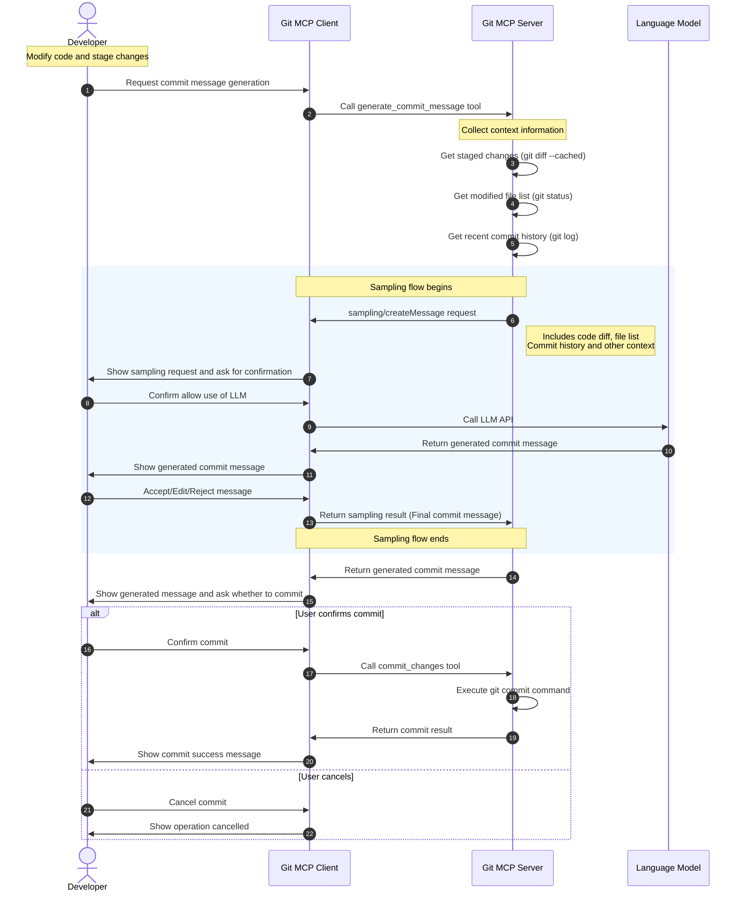
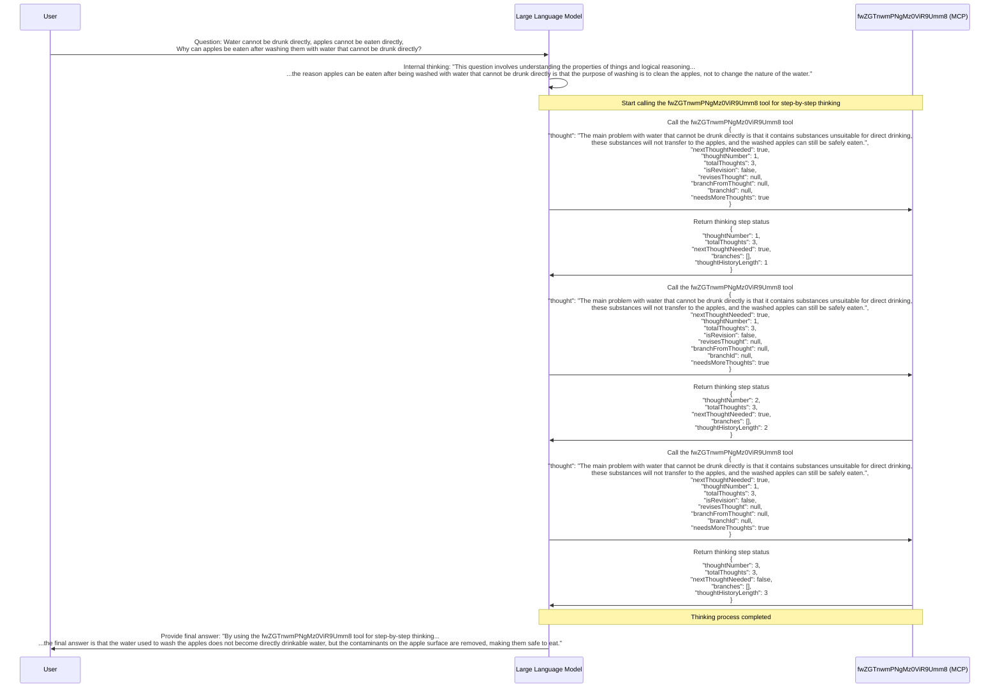
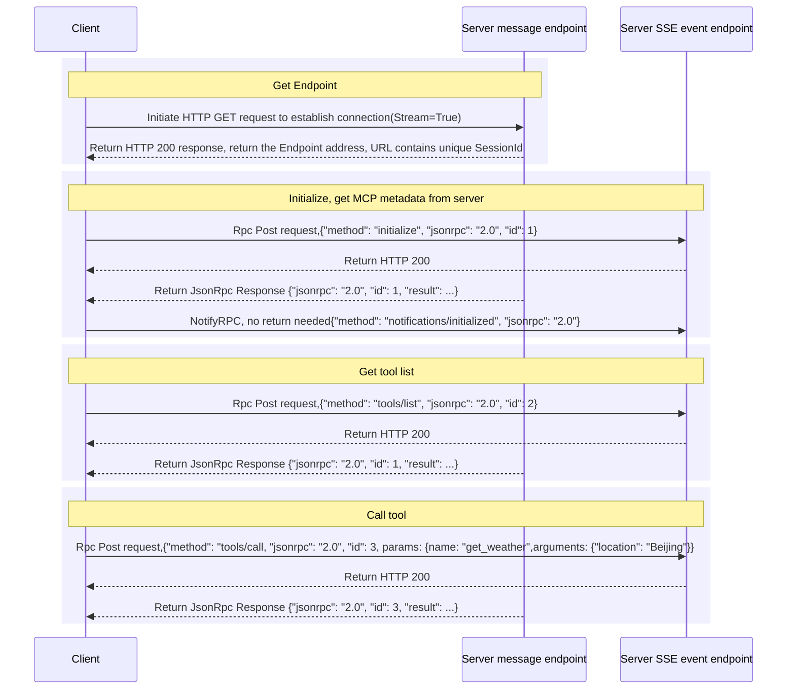

## 1. What Is MCP (Model Context Protocol)

MCP (Model Context Protocol) is a communication protocol launched and open-sourced by Anthropic in 2024, designed to solve the connection problem between large language models (LLMs) and external data sources and tools. It defines the protocol for communication between the Model and external interfaces/data/Prompts. Tool/resource providers only need to implement the MCP protocol to connect with an LLM APP that implements an MCP client. During runtime, the LLM APP automatically retrieves the tool list/Prompt/resource list returned by the protocol from the MCP server via JsonRpc.

> A simple example: integrating Amap so the model can query weather/route/surrounding map information through Amap's API.
> 1. Without MCP: you need to implement the Tools that call Amap's OpenAPI yourself, and write the Prompt that organizes requests to the LLM yourself.
> 2. With MCP: just use an MCP Client, fill in the Endpoint and Key of the Amap MCP Service, and the LLM will proactively query Amap-related resources through MCP during runtime, and feed back to the LLM using the Prompt that Amap has already organized.

## 2. What MCP defines:

The primitives MCP defines:
1. Tools: FunctionCall
2. Resource: resources
3. Prompts: provide structured templates
4. Sampling: allows the server to request that the client call the LLM

### 2.1 Tools:

People often compare FunctionCall and MCP, and some even lament that "why must both FunctionCall and MCP exist?" Personally, I don't think FunctionCall and MCP conflict. FunctionCall is actually a subset of MCP, and MCP also supports FunctionCall — it's just that MCP additionally supports definitions like Resource/Prompt, and imposes explicit protocol constraints on their retrieval/invocation/update at the protocol layer.

MCP defines the tool retrieval and invocation protocol at the protocol layer:
1. `tools/list` Retrieve the list of all tools currently provided by the MCP, mainly metadata: the tool description, the required parameters, and the schema of the output.
2. `tools/call` Perform the action of invoking a tool and obtain the result.
3. `notifications/tools/list_changed` Update the Tools information cached on the Client side via Push over a long-lived connection. MCP Server -> Client

Using it in an Agent generally follows the same approach as traditional FunctionCall: after connecting to the MCP and retrieving the Meta of all Tools, you can simply render them into the SystemPrompt.

### 2.2 Resources

A Resource in MCP is an application-controlled primitive that lets a server expose data and content to a client that can be read, and that content can be used as context for LLM (large language model) interactions. Resources are similar to the definition of a resource in a RESTful interface; it can be a file / database record / API response / log file.

MCP requires every resource entity to have a unique URI, in standard URL format`protocol://host/path`, and the handler has a URI — for example, if you want to expose a table in postgres as a resource, its URI is`postgres://<host>:5432/<schema>/<database>/<table>`.

In MCP, the metadata of a resource is defined as:

```typescript
export interface Resource {
  uri: string;
  name: string;
  description?: string;
  mimeType?: string;
  annotations?: Annotations;
  size?: number;
}

```

A resource is actually fetched as a whole, and that is the biggest difference from FunctionCall. For example, in the database scenario, if I implement a QueryTools it can also achieve an effect similar to a resource, but a resource puts more emphasis on returning all the resource's information in one shot, while Tools emphasize the result obtained by performing some action, and the action may be a read or a write.

### 2.3 Prompt

The Prompt templates specific to different MCP Servers — as long as they are Prompts tailored to the functionality the current MCP provides — generally allow Prompts to quickly enable the LLM to better invoke the capabilities of the tools in the MCP Server.

For example, a code-refactoring Agent:
1. Resource: The resources provided by its MCP Server are generally local code files, as well as standard files for code conventions.
2. Tools: These are generally the results of local Lint tools checking specific files. For example, analyze_code_complexity/check_code_standards/check_code_type
3. Prompt: This generally provides unique code-convention Prompts, as well as how the large model should use the tools. For example, it can provide the model with a sequence to call during refactoring: check_code_standards->check_code_standards->check_code_type

### 2.4 Sampling

Sampling is an MCP feature that allows a **server to request an LLM completion from the client**. This stands in sharp contrast to the traditional interaction pattern: normally the client requests data or functionality from the server, but with Sampling the server can proactively ask the client to invoke an LLM to generate text or perform reasoning.

Put simply, Sampling lets an MCP server "reverse" the use of the language model connected to the client, enabling more complex AI agent behavior while maintaining security and privacy controls.

The Sampling workflow follows these steps:

1. **Server initiates the request**: the server sends a `sampling/createMessage` request to the client
2. **Client review**: the client inspects the request and may modify it
3. **LLM invocation**: the client calls the LLM and obtains the completion
4. **Client reviews the result**: the client inspects the content generated by the LLM
5. **Return the result**: the client returns the result to the server.

When requesting Sampling, the server can supply various parameters to fine-tune the LLM's behavior:

- **temperature**: controls randomness (0.0 to 1.0)
- **maxTokens**: the maximum number of tokens to generate
- **stopSequences**: an array of sequences that stop generation
- **metadata**: additional provider-specific parameters

The server can also use the **modelPreferences** object to specify model selection preferences, and the **systemPrompt** field to request a particular system prompt, but the client ultimately decides which model to use and whether to honor the system prompt.

Sampling is especially useful in scenarios that require "agentic behavior", that is, where the server needs the LLM's help to complete a task. Typical use cases include:

1. **Git service tools**: request the LLM to write a commit message based on a code diff.
2. **Data analysis services**: request the LLM to explain data analysis results and provide insights.
3. **Content generation**: generate text content for domain-specific tools, such as email drafts or document summaries.
4. **Complex decisions**: request the LLM to make decision recommendations based on domain-specific data provided by the server.

A Case



## 3. A Modern MCP Example

### 3.1 Sequential Thinking MCP + Using MCP Function for State Intervention

[Sequential Thinking MCP](https://github.com/modelcontextprotocol/servers/blob/main/src/sequentialthinking/index.ts) is a standard MCP example. It guides the LLM through functions to think step by step and reach a conclusion. Its Tool Prompt template is:

```markdown
A detailed tool for dynamic and reflective problem-solving through thoughts.
This tool helps analyze problems through a flexible thinking process that can adapt and evolve.
Each thought can build on, question, or revise previous insights as understanding deepens.

When to use this tool:
- Breaking down complex problems into steps
- Planning and design with room for revision
- Analysis that might need course correction
- Problems where the full scope might not be clear initially
- Problems that require a multi-step solution
- Tasks that need to maintain context over multiple steps
- Situations where irrelevant information needs to be filtered out

Key features:
- You can adjust total_thoughts up or down as you progress
- You can question or revise previous thoughts
- You can add more thoughts even after reaching what seemed like the end
- You can express uncertainty and explore alternative approaches
- Not every thought needs to build linearly - you can branch or backtrack
- Generates a solution hypothesis
- Verifies the hypothesis based on the Chain of Thought steps
- Repeats the process until satisfied
- Provides a correct answer

Parameters explained:
- thought: Your current thinking step, which can include:
* Regular analytical steps
* Revisions of previous thoughts
* Questions about previous decisions
* Realizations about needing more analysis
* Changes in approach
* Hypothesis generation
* Hypothesis verification
- next_thought_needed: True if you need more thinking, even if at what seemed like the end
- thought_number: Current number in sequence (can go beyond initial total if needed)
- total_thoughts: Current estimate of thoughts needed (can be adjusted up/down)
- is_revision: A boolean indicating if this thought revises previous thinking
- revises_thought: If is_revision is true, which thought number is being reconsidered
- branch_from_thought: If branching, which thought number is the branching point
- branch_id: Identifier for the current branch (if any)
- needs_more_thoughts: If reaching end but realizing more thoughts needed

You should:
1. Start with an initial estimate of needed thoughts, but be ready to adjust
2. Feel free to question or revise previous thoughts
3. Don't hesitate to add more thoughts if needed, even at the "end"
4. Express uncertainty when present
5. Mark thoughts that revise previous thinking or branch into new paths
6. Ignore information that is irrelevant to the current step
7. Generate a solution hypothesis when appropriate
8. Verify the hypothesis based on the Chain of Thought steps
9. Repeat the process until satisfied with the solution
10. Provide a single, ideally correct answer as the final output
11. Only set next_thought_needed to false when truly done and a satisfactory answer is reached
```

Below, the classic "Weak-minded Bar" question — "You can't drink it directly, and you can't eat an apple directly, so why is it that once you wash the apple with water that you can't drink directly, you can eat it?" — is used as the query to demonstrate the whole guidance process.



## 4. Transport Layer

The Agent system communicates with McpClient via JsonRpc:
Two modes:
1. stdio pipe: The overall logic of the protocol comes from the Language Server Protocol. When the Agent starts, it launches the MCP Client by starting a subprocess, and the Agent communicates with the MCP service by sending JsonRpc messages through the stdio pipe.
2. HTTP-SSE/Streamable-HTTP service: Allows remote communication over HTTP Stream. The old protocol used HTTP-SSE (HTML5), which allows bidirectional communication with the MCP Server through a long-lived HTTP Stream connection to the server. Starting in April 2025, Streamable-HTTP is supported (https://github.com/modelcontextprotocol/modelcontextprotocol/pull/206）， deprecates the previous HTTP-SSE protocol. Streamable-HTTP is better optimized for compute forms like FC.

### Why use such a strange HTTP-SSE approach with separate event endpoint and message endpoint:

> The separation of the session establishment and messaging endpoints is intended to simplify Cross-Origin Resource Sharing (CORS). By > providing a 'simple' HTTP POST endpoint for message exchange, CORS preflight requests can be avoided
> 1. MCP's main use case is in the browser. Without separating the endpoints, the SessionID information would be carried in the HTTP headers, which does not satisfy the browser's Simple Request requirement and would require a CORS preflight check [OPTIONS]
> 2. By separating the endpoints, all requests can become "simple requests" and will not trigger an OPTIONS check
> 3. Why Stream-HTTP later abandoned this approach:    
>    a. It was decided that the performance impact of CORS preflight in modern web development is no longer a major issue
>    b. The implementation complexity introduced by endpoint separation outweighed the benefit of avoiding preflight
>    c. It provides a clearer session management mechanism (via the Mcp-Session-Id header)
> Cloudflare introduced: https://github.com/modelcontextprotocol/modelcontextprotocol/pull/206

### HTTP-SSE Client Python implementation:

1. An implementation using thread-synchronous programming needs a separate thread to establish an HTTP-Stream long connection with the Msg Endpoint to receive the JsonRpc return events, and to notify the main thread to harvest events via a callback function plus a queue.



A simple Python implementation

```python
import os
import queue
import threading
import logging
from typing import Any, Callable, Literal

import json

from urllib.parse import urljoin
from pydantic import BaseModel, ConfigDict
import requests

logger = logging.getLogger(__name__)


class Message(BaseModel):
    event_type: Literal["message"]
    data: str


class JsonRpcHeader(BaseModel):
    method: str
    jsonrpc: str = "2.0"


class JsonRpcRequest(JsonRpcHeader):
    params: dict | None = None
    id: int


class JsonRpcNotify(JsonRpcHeader): ...


type JsonRpcMessage = JsonRpcHeader | JsonRpcNotify


class JSONRPCResponse(BaseModel):
    """A successful (non-error) response to a request."""

    jsonrpc: str
    id: int
    result: dict[str, Any]
    model_config = ConfigDict(extra="allow")


class SSEClient(threading.Thread):
    def __init__(self, url: str) -> None:
        super().__init__()
        self._url = url
        self._queue = queue.Queue()
        self._ready_event = threading.Event()
        self._endpoint = ""
        self._callback = {}

    def run(self) -> None:
        print("run")
        self._event_loop()

    def wait_ready_for_endpoint(self) -> str:
        self._ready_event.wait()
        return self._endpoint

    def register_callback(
        self, message_type: str, callback: Callable[[Message], None]
    ) -> None:
        self._callback[message_type] = callback

    def _event_loop(self) -> None:
        response = requests.get(
            self._url,
            stream=True,
        )

        if response.status_code not in (200, 202):
            raise Exception(f"Failed to connect to server: {response.status_code}")

        event_type = None
        event_data = None

        for line in response.iter_lines(chunk_size=2, decode_unicode=True):
            print(line)
            if line.startswith("event:"):
                event_type = line[6:].strip()
            if line.startswith("data:"):
                event_data = line[5:].strip()

            if event_data is not None and event_type is not None:
                match event_type:
                    case "message":
                        msg = Message(event_type=event_type, data=event_data)
                        if "message" in self._callback:
                            try:
                                self._callback["message"](msg)
                            except Exception as e:
                                logger.error(e)
                        else:
                            self._queue.put(msg)

                    case "endpoint":
                        event_data = event_data.strip()
                        self._endpoint = event_data
                        self._ready_event.set()

                event_type, event_data = None, None


class McpClient:
    def __init__(
        self, sse: SSEClient, endpoint: str, session: requests.Session
    ) -> None:
        self._endpoint = endpoint
        self._sse = sse
        self._sess = session
        self.capabilities = {}
        self._id = 0
        self._callback_record = {}
        self._sse.register_callback("message", self.notify_callback)

    def initialize(self) -> None:
        result: dict = self._send_request(
            method="initialize",
            params={
                "protocolVersion": "2024-11-05",
                "capabilities": {"tools": {"call": True}, "resources": {"read": True}},
                "clientInfo": dict(name="mcp", version="0.1.0"),
            },
        )
        self.capabilities = result.get("capabilities", {})
        self._send_request(method="notifications/initialized")

    def get_tools(self) -> dict:
        return self._send_request(method="tools/list")
    
    def call_tool(self, tool_name: str, params: dict) -> dict:
        return self._send_request(
            method="tools/call",
            params={
                "name": tool_name,
                "arguments": params,
            },
        )

    def notify_callback(self, message: Message) -> None:
        response = JSONRPCResponse.model_validate(json.loads(message.data))
        if response.id in self._callback_record:
            self._callback_record[response.id](response)

    def _send_request(self, method: str, params: dict | None = None) -> dict | None:

        event = threading.Event()
        result = None
        if "notifications" in method:
            data = JsonRpcNotify(
                method=method,
            )
        else:
            data = JsonRpcRequest(
                method=method,
                params=params,
                id=self._id,
            )

            def get_result(item):
                nonlocal result
                event.set()
                result = item.result

            self._callback_record[self._id] = get_result
            self._id += 1

        print(f"request: url:{self._endpoint} data:{data.json()}")

        response = self._sess.post(
            url=self._endpoint,
            json=data.model_dump(
                mode="json",
                exclude_none=True,
            ),
        )

        if response.status_code not in (200, 202):
            raise Exception(f"Connect Error: {response.text}")

        if "notifications" in method:
            return None

        event.wait()
        return result


def main() -> None:
    base = "https://mcp.amap.com/sse?key=" + os.environ["AMAP_KEY"]

    sse_client = SSEClient(url=base)
    sse_client.start()
    endpoint = sse_client.wait_ready_for_endpoint()

    mcp = McpClient(
        sse=sse_client, endpoint=urljoin(base, endpoint), session=requests.Session()
    )
    mcp.initialize()
    print("init Ok!")
    tools = mcp.get_tools()
    for tool in tools['tools']:
        print(f"tool: {tool['name']}")
        print(f"  description: {tool['description']}")
        print(f"  parameters: {json.dumps(tool['inputSchema'], indent=2, ensure_ascii=False)}")
    
    print("get tools Ok!")
    
    # Call a tool
    result = mcp.call_tool("maps_weather", {"city": "北京"})
    print("call_tool Ok!")
    print(f"result: {json.dumps(result, indent=2, ensure_ascii=False)}")
    
    exit()


if __name__ == "__main__":
    main()
```

## References
1. [RFC Streamable HTTP](https://github.com/modelcontextprotocol/modelcontextprotocol/pull/206)
2. [MCP begins supporting Streamable](https://github.com/modelcontextprotocol/modelcontextprotocol/pull/206)
3. [How to deploy MCP on Cloudflare Workers](https://blog.cloudflare.com/remote-model-context-protocol-servers-mcp/)
4. [MCP Server](https://github.com/modelcontextprotocol/modelcontextprotocol/blob/main/schema/2025-03-26/schema.ts#L164)
